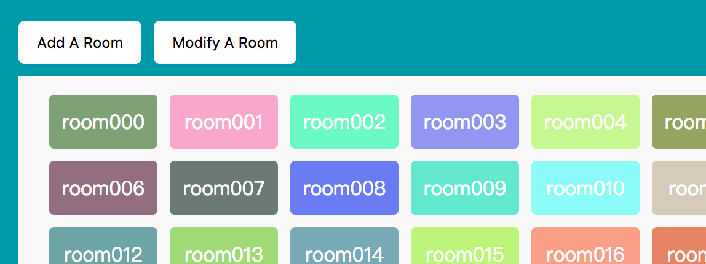
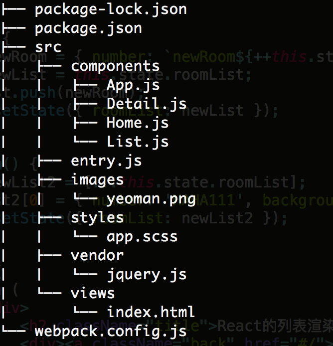
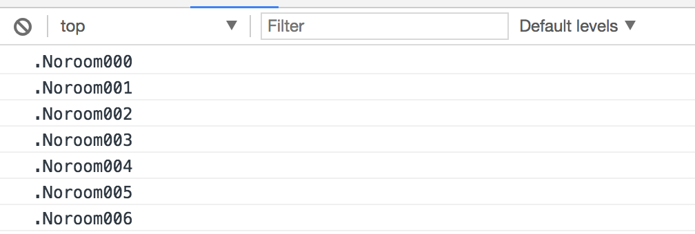
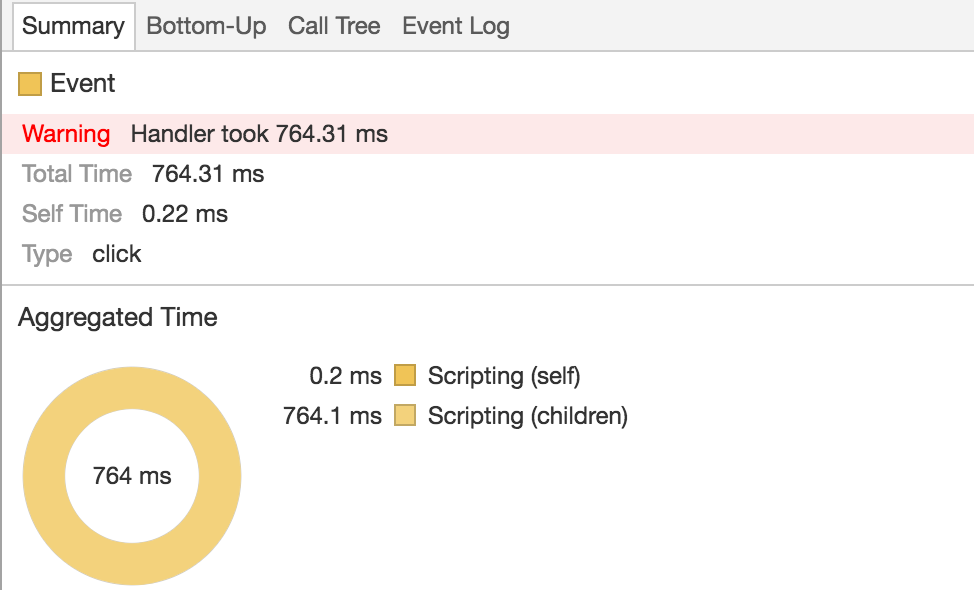
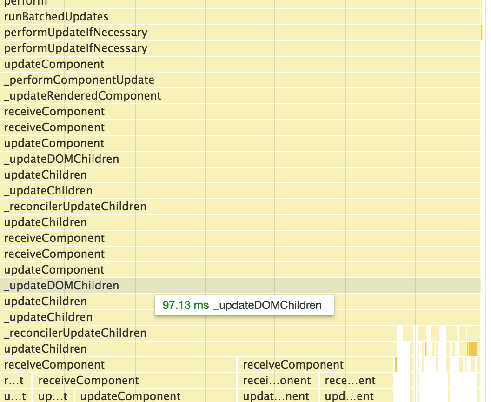
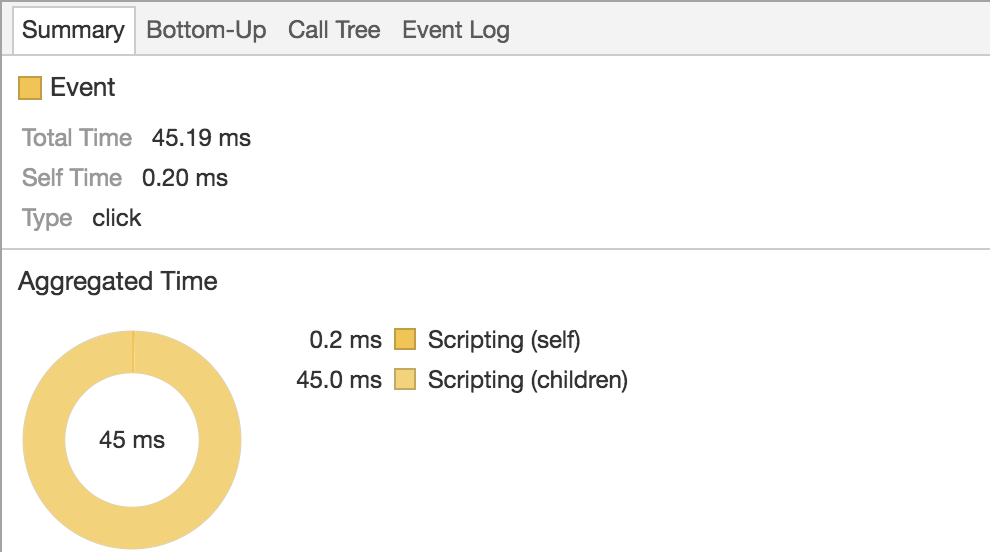
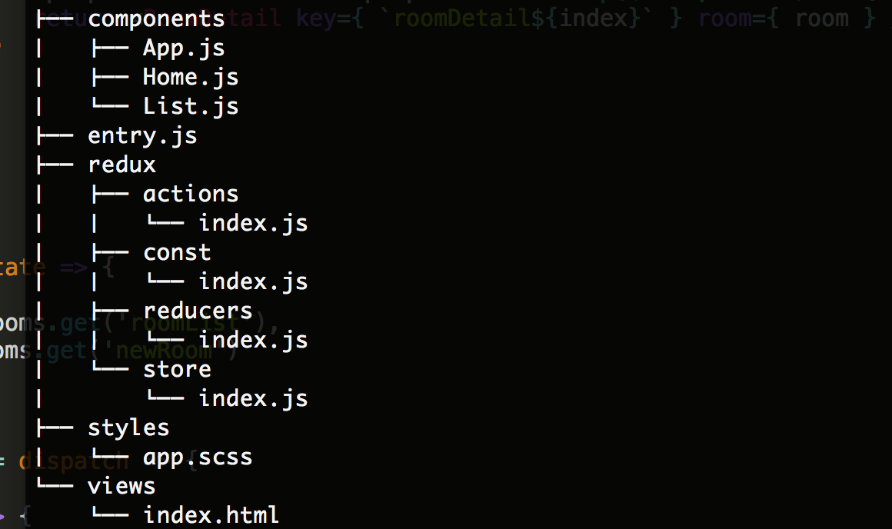
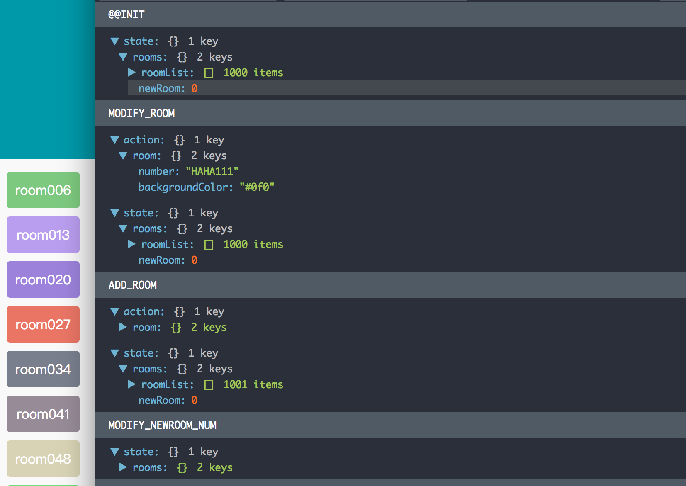
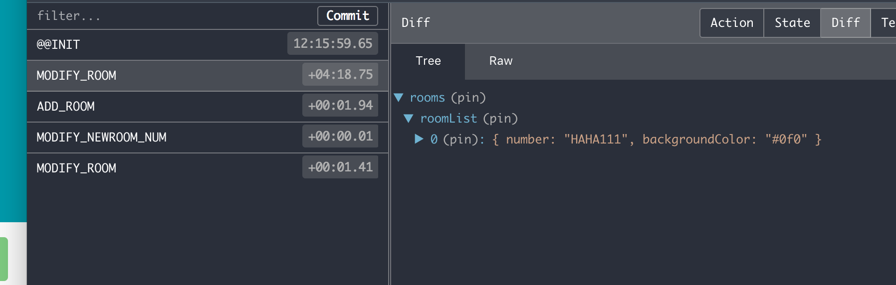

## React渲染问题研究以及Immutable的应用

### 写在前面

这里主要介绍自己在`React`开发中的一些总结，关于`react`的渲染问题的一点研究。

另外本人一直希望在`React`项目中尝试使用，因此在之前已经介绍过`immutable`的API，可以参看这里[Immutable日常操作之深入API](http://www.rynxiao.com/%E6%8A%80%E6%9C%AF/2017/08/29/immutable-apis.html)，算是对其的一个补充。

### 一、渲染房间列表

这个例子主要是写了同时渲染1000个房间，如果我添加一个房间或者修改一个房间，在`react`中不同的实现方式下`render`函数将会表现出什么样的结果？以及针对不同结果的一些思考和优化。大致的列表例子如下：生成1000个不同的房间盒子，颜色随机。



项目整体目录结构大致是这样的：



下面主要来看`ListDetail.js`中是如何写的：

- 父组件`List`
- 子组件`RoomDetail`,子组件的功能只是纯粹的渲染功能，自身并没有任何操作

子组件：

```javascript
// 子组件
class RoomDetail extends React.Component {

	constructor(props) {
		super(props);
	}

	render() {
		let room = this.props.room;
		
		return (
			<li 
          		className="list-item" 
          		style={{ backgroundColor: room.backgroundColor }}>
          		{ room.number }
          	</li>
		);
	}

}
```

父组件：

```javascript
// 父组件
export default class List extends React.Component {
	
  	// ...
  
	constructor(props) {
		super(props);
		this.addRoom = this.addRoom.bind(this);
		this.modifyRoom = this.modifyRoom.bind(this);
		this.state = {
			roomList: this.generateRooms(),
			newRoom: 0
		};
	}
  
  	// ...

	render() {
		return (
			<div>
                <h2 className="title">React的列表渲染问题</h2>
                <div><a className="back" href="#/">返回首页</a></div>
                <div className="btn-operator">
                	<button onClick={ this.addRoom }>Add A Room</button>
                	<button onClick={ this.modifyRoom }>Modify A Room</button>
                </div>
                <ul className="list-wrapper">
                	{
                		this.state.roomList.map((room, index) => {
                			return <RoomDetail key={ `roomDetail${index}` } room={ room } />
                		})
                	}
                </ul>
            </div>
		);
	}
}
```

下面我们来添加一个房间试试

```javascript
// 添加房间
addRoom() {
  	let newRoom = { number: `newRoom${++this.state.newRoom}`, backgroundColor: '#f00' };
  	let newList = this.state.roomList;
  	newList.push(newRoom);
  	this.setState({ roomList: newList });
}
```

这个操作主要是生成一个新的房间，然后从`state`中取出当前的房间列表，然后再当前的房间列表中添加一个新的房间，最后将整个列表从新设置到状态中。

很显然，此时由于父组件的状态发生了变化，会引起自身的`render`函数执行，同时列表开始重新遍历，然后将每一个房间信息**重新**传入到子组件中。是的，重新传入，就代表了子组件将会重新渲染。我们可以来做一个测试，在子组件的`render`方法中加入如下打印：

```javascript
render() {
	let room = this.props.room;
	console.log(`.No${room.number}`);
  
  	return (
    	// ...
  	);
}
```

不出意外的发现了所有的子组件渲染的证据：



同时利用`chorme`的`Performance`检测的信息如下：



调用的方法堆栈如下：



渲染子组件的时间达到`764ms`，同时在堆栈中可以看到大量的`receiveComponent`和`updateChildren`方法的执行。那么有没有什么办法只渲染改变的部分呢？在[react官网](https://facebook.github.io/react/docs/optimizing-performance.html)性能监控这一小节中有提到一个方法，将子组件继承`React.PureComponent`可以局部有效防止渲染。加上之后的代码是这样的：

```javascript
class RoomDetail extends React.PureComponent {
	// ...
}
```

所有的东西都没有变化，只是将`Component`换成了`PureComponent`。下面我们再来测试一下：


性能检测图如下：



效果出奇的好，果然只是渲染了一次，并且速度提升了10几倍之多。

其中的原理是在组件的`shouldComponentUpdate`方法中进行了`props`与`state`的比较，如果认为他们相等，则会返回`false`，否则则会返回`true`。

```javascript
// react/lib/ReactComponentWithPureRenderMixin.js
var ReactComponentWithPureRenderMixin = {
  	shouldComponentUpdate: function (nextProps, nextState) {
    	return shallowCompare(this, nextProps, nextState);
  	}
};
```

同时官网也说了，这只是局部有效，为什么呢？因为这些值的比较都只是**浅比较**，也就是只是第一层的比较。那么会出现什么问题，我们来看下面的操作：

修改其中的一个房间：

```javascript
// 修改房间
modifyRoom() {
  	let newList2 = this.state.roomList;
  	newList2[0] = { number: 'HAHA111', backgroundColor: '#0f0' };
  	this.setState({ roomList: newList2 });
}
```

很意外，当我添加了一个房间之后，发现第一个房间并没有我们想象中的发生变化。为什么？

原因是我虽然修改了第一个房间的数据，当时我并没有修改他的引用地址。类似下面这样的：

```javascript
var arr = [{ a: 1 }, { b: 2 }];
var arr2 = arr1;
arr2[0] = { c: 1 };
arr === arr2; 	// true
```

因此在子组件中比较房间的时候，就会出现比较的值相等的情况，此时将会返回`false`

那么有没有办法改变这个问题，我找到了两个办法：

- 从数据源头入手
- 从子组件是否渲染条件入手

**从数据源头入手**，即为改造数据，将数据进行**深拷贝**，使得原先的引用与新得到的对象的引用不相同即可。关于深拷贝的实现方法有很多，我这里贴一个，之后再仔细做研究。

```javascript
// 这个函数可以深拷贝 对象和数组
var deepCopy = function(obj){
    var str, newobj = obj.constructor === Array ? [] : {};
    if(typeof obj !== 'object'){
        return;
    } else if(window.JSON){
        str = JSON.stringify(obj), //系列化对象
        newobj = JSON.parse(str); //还原
    } else {
        for(var i in obj){
            newobj[i] = typeof obj[i] === 'object' ? 
            deepCopy(obj[i]) : obj[i]; 
        }
    }
    return newobj;
};
```

在ES6中提供了一种解构方式，这种方式也可以实现数组的深层次拷贝。类似这样的

```javascript
let arr = [1, 2, 3, 4];
let arr1 = [...arr];
arr1 === arr; 	// false

// caution
let arr = [{ a: 1 }, { b: 2 }];
let arr1 = [...arr];
arr1 === arr; 			// false
arr1[0] = { c: 3 };
arr1[0] === arr[0];		// false
arr1[1] === arr[1]; 	// true
```

因此我把`modifyRoom`函数进行了如此改造：

```javascript
// 修改房间
modifyRoom() {
  	let newList2 = [...this.state.roomList];
  	newList2[0] = { number: 'HAHA111', backgroundColor: '#0f0' };
  	this.setState({ roomList: newList2 });
}
```

因此在比较第一个对象的时候，发现它们已经不相等了，则会重新渲染。

**从子组件是否渲染条件入手**，可以不需要使用`React.PureComponent`，而直接在`shouldComponentUpdate`方法入手。因为两次值改变之后，我清楚得可以知道，改变的值只是第一个对象中的数值改变。那么我可以这么写来判断：

```javascript
class RoomDetail extends React.Component {

	constructor(props) {
		super(props);
	}
  
  	shouldComponentUpdate(nextProps, nextState) {
		if (nextProps.room.number === this.props.room.number) {
			return false;
		} 
		return true;
	}

	render() {
		let room = this.props.room;
		
		return (
			<li 
          		className="list-item" 
          		style={{ backgroundColor: room.backgroundColor }}>
          		{ room.number }
          	</li>
		);
	}

}
```

同样得可以达到效果。但是如果在`shouldComponentUpdate`中存在着多个`props`和`state`中值改变的话，就会使得比较变得十分复杂。

### 二、应用Immutable.js来检测React中值的变化问题

在官网上来说，`immutable`提供的数据具有不变性，被称作为`Persistent data structure`，又或者是`functional data structure`，非常适用于函数式编程，相同的输入总会预期到相同的输出。

#### 2.1 immutable的性能

在`immutable`官网以及在知乎中谈到为什么要使用`immutable`的时候，会看到一个关键词`efficient`。高效地，在知乎上看到说是性能十分好。在对象深复制、深比较上对比与`Javascript`的普通的深复制与比较上来说更加地节省空间、提升效率。我在这里做出一个实验（这里我并不保证实验的准确性，只是为了验证一下这个说法而已）。

实验方法：我这里会生成一个对象，对象有一个广度与深度，广度代表第一层对象中有多少个键值，深度代表每一个键值对应的值会有多少层。类似这样的：

```json
{
  "width0": {"key3": {"key2": {"key1": {"key0":"val0"}}}},
  "width1": {"key3": {"key2": {"key1": {"key0":"val0"}}}},
  "width2": {"key3": {"key2": {"key1": {"key0":"val0"}}}},
  // ...
  "widthN": {"key3": {"key2": {"key1": {"key0":"val0"}}}}
}
```

因此实际上在`javascript`对象的复制和比较上，需要遍历的次数其实是`width * deep`。

在复制的问题上，我做了三种比较。

- deepCopy(obj)
- JSON.parse(JSON.stringify(obj))
- Immutable

最终得到的数据为：

|           | deepCopy( μs ) | JSON( μs ) | Immutable( μs ) |
| :-------: | :------------: | :--------: | :-------------: |
|  20 * 50  |      4000      |    9000    |       20        |
| 20 * 500  |      8000      |   10000    |       20        |
| 20 * 5000 |     10000      |   14000    |       20        |

在比较上，我只比较了两种方式：

- javascript deep compare
- Immutable.is

代码如下：

```javascript
let startTime1 = new Date().getTime();
let result1 = Equals.equalsObject(gObj, deepCopyObj);
let endTime1 = new Date().getTime();
console.log(result1);
console.log(`deep equal time ${(endTime1-startTime1)*1000}μs`);

let startTime2 = new Date().getTime();
let result2 = is(this.state.immutableObj, this.state.aIObj);
let endTime2 = new Date().getTime();
console.log(result2);
console.log(`immutable equal time ${(endTime2-startTime2)*1000}μs`);
```

最终得到的数据为：

|           | deepCompare(  μs ) | Immutable.is( μs ) |
| :-------: | :----------------: | :----------------: |
|  20 * 5   |         0          |        7000        |
|  20 * 50  |        1000        |       27000        |
| 20 * 500  |        6000        |       24000        |
| 20 * 5000 |       84000        |        5000        |

数据的设计上可能太过单一，没有涉及到复杂的数据，比如说对象中再次嵌套数组，并且在每一个键值对应的值得广度上设计得也太过单一，只是一条直线下来。但是当数据量达到一定的程度时，其实也说明了一些问题。

**总结：**

1. 对象复制上来说，基本上`Immutable`可以说是零消耗
2. 对象比较上，当对象深层嵌套到一定规模，反而`Immutable.is()`所用的时间会更少
3. 但是在数据方面来说，`Immutable`并快不了多少

**当然只是测试，平时中的纵向嵌套达到三层以上都会认为是比较恐怖的了。**

于是我去`google`翻了翻，看看有没有什么更好的`demo`，下面我摘录一些话。

[What is the benefit of immutable.js?](https://www.reddit.com/r/reactjs/comments/4tnie1/what_is_the_benefit_of_immutablejs/)

> Immutable.js makes sure that the **"state" is not mutated outside** of say redux. For smaller projects, personally i don't think it is worth it but for bigger projects with more developers, using the same set of API to create new state in reduce is quite a good idea
>
> It was mentioned many times before that Immutable.js **has some internal optimizations**, such as storing lists as more complex tree structures which give better performance when searching for elements. It's also often pointed out that using Immutable.js enforces immutability, whereas using Object.assign or object spread and destructuring assignments relies to developers to take care of immutability. EDIT: **I haven't yet seen a good benchmark of Immutable.js vs no-library immutability.** If someone knows of one please share. Sharing is caring :)
>
> Immutable.js adds **two** things: **Code enforcement:** by disallowing mutations, you avoid strange errors in redux and react. Code is substantially easier to reason about. **Performance**: Mutation operations for larger objects are substantially faster as the internals are a tree structure that does not have to copy the entirety of an object every assignment. **In conclusion**: it's a no brainer for decently scoped applications; but for playing around it's not necessary.

[https://github.com/reactjs/redux/issues/1262](https://github.com/reactjs/redux/issues/1262)

> yes, obviously **mutable is the fastest** but it won't work with how redux expects the data, which is immutable

[Performance Tweaking in React.js using Immutable.js](http://johnnyji.me/react/2016/03/03/performance-optimization-in-reactjs-using-immutablejs.html)

> But wait… This is can get really ugly really fast. I can think of two general cases where your `shouldComponentUpdate` can get out of hand.
>
> ```Javascript
> // Too many props and state to check!
>
>   shouldComponentUpdate(nextProps, nextState) {
>     return (
>       this.props.message !== nextProps.message ||
>       this.props.firstName !== nextProps.firstName ||
>       this.props.lastName !== nextProps.lastName ||
>       this.props.avatar !== nextProps.avatar ||
>       this.props.address !== nextProps.address ||
>       this.state.componentReady !== nextState.componentReady
>       // etc...
>     );
>   }
> ```

是的，我并没有得出`Immutable`在性能上一定会很快的真实数据。但是不得不提到的是他在配合`Redux`使用的时候的一个天然优势——数据是不变的。并且在最后一个链接中也提到，在配合`React`使用中通过控制`shouldComponentUpdate`来达到优化项目的目的。

**however，Let's write some examples about immutable used in react to make sense.**

#### 2.2 房间列表加入Immutable

在父组件中的改变：

```javascript
constructor(props) {
  	super(props);
  	this.addRoom = this.addRoom.bind(this);
  	this.modifyRoom = this.modifyRoom.bind(this);
  	this.state = {
      	// roomList: this.generateRooms()
      	roomList: fromJS(this.generateRooms()),
      	newRoom: 0
    };
}

addRoom() {
  	// let newRoom = { number: `newRoom${++this.state.newRoom}`, backgroundColor: '#f00' };
	// let newList = this.state.roomList;
	// newList.push(newRoom);
  	let newRoom = Map({ number: `newRoom${++this.state.newRoom}`, backgroundColor: '#f00' });
  	let newList = this.state.roomList.push(newRoom);
  	this.setState({ roomList: newList });
}

modifyRoom() {
  	// let newList = [...this.state.roomList];
  	// newList[0] = { number: 'HAHA111', backgroundColor: '#0f0' };
  	let list = this.state.roomList;
  	let newList = list.update(0, () => {
      	return Map({ number: 'HAHA111', backgroundColor: '#0f0' });
    });
  	this.setState({ roomList: newList });
}
```

子组件中：

```javascript
shouldComponentUpdate(nextProps, nextState) {
    return !is(formJS(this.props), fromJS(nextProps)) || 
      	   !is(fromJS(this.state), fromJS(nextState));
}
```

将数据源用`Immutable`初始化之后，之后再进行的数据改变都只要遵守`ImmutableJS`的相关API即可，就可以保证数据的纯净性，每次返回的都是新的数据。与源数据的比较上就不可能会存在改变源数据相关部分之后，由于引用相等而导致数据不相等的问题。

### 三、在Redux中运用immutable

我在项目底下新建了一个项目目录`redux-src`，同时在项目中增加了热更新。新建了`webpack.config.redux.js`，专门用来处理新加的`redux`模块。具体代码可以上`github`上面去看。因此新的目录结构如下：



`webpack.config.redux.js`文件如下：

```javascript

'use strict';
var webpack = require("webpack");
var ExtractTextPlugin = require("extract-text-webpack-plugin");  //css单独打包

module.exports = {
    devtool: 'eval-source-map',

    entry: [
        __dirname + '/redux-src/entry.js', //唯一入口文件
        "webpack-dev-server/client?http://localhost:8888",
        "webpack/hot/dev-server"
    ],
    
    output: {
        path: __dirname + '/build', //打包后的文件存放的地方
        filename: 'bundle.js',      //打包后输出文件的文件名
        publicPath: '/build/'
    },

    module: {
        loaders: [
            { test: /\.js$/, loader: "react-hot!jsx!babel", include: /src/},
            { test: /\.css$/, loader: ExtractTextPlugin.extract("style", "css!postcss")},
            { test: /\.scss$/, loader: ExtractTextPlugin.extract("style", "css!postcss!sass")},
            { test: /\.(png|jpg)$/, loader: 'url?limit=8192'}
        ]
    },

    postcss: [
        require('autoprefixer')    //调用autoprefixer插件,css3自动补全
    ],

    plugins: [
        new ExtractTextPlugin('main.css'),
        new webpack.HotModuleReplacementPlugin()
    ]
}
```

在项目中运行`npm run redux`，在浏览器输入`localhost:8888`即可看到最新的模块。

这里关于如何在`react`中使用`redux`，这里就不多说了，如果不明白，可以去看 [http://cn.redux.js.org/ ](http://cn.redux.js.org/)或者到我之前写的 [redux的一个小demo](http://blog.csdn.net/yuzhongzi81/article/details/51880577)中去看。

重点说说如何在`reducer`中使用`Immutable`，以及在`List.js`中如何通过发送`Action`来改变`store`。

#### redux-src/redux/reducers/index.js

```javascript
import { fromJS } from 'immutable';
import { combineReducers } from 'redux';

import { ADD_ROOM, MODIFY_ROOM, MODIFY_NEWROOM_NUM } from '../const';
import { addRoom, modifyRoom, modifyNewRoomNum } from '../actions';

// ... generateRooms()

const initialState = fromJS({
	roomList: generateRooms(),
	newRoom: 0
});

function rooms(state = initialState, action) {
	switch(action.type) {
		case ADD_ROOM: 
			return state.updateIn(['roomList'], list => list.push(action.room));
		case MODIFY_ROOM:
			return state.updateIn(['roomList', 0], room => action.room);
		case MODIFY_NEWROOM_NUM:
			return state.updateIn(['newRoom'], num => ++num);
		default:
			return state;
	}
}

export default combineReducers({
	rooms
});
```

跟之前`List.js`中的`state`中声明的最开始状态一样。这里依旧维持一个最开始的房间列表以及一个新增房间的序号数。只不过这里的最初状态是通过`Immutable.js`处理过的，所以在`reducer`中的所有操作都必须按照其`API`来。

#### redux-src/components/List.js

其实这个文件也没有作多处修改，基本可以看引入了`immutable`的`state`管理的`Detail.js`。只是在操作上显得更加简单了。

```javascript
addRoom() {
  	let { newRoom, onAddRoom, onModifyRoomNum } = this.props;
  	let room = Map({ number: `newRoom${newRoom}`, backgroundColor: '#f00' });
  	onAddRoom(room);
  	onModifyRoomNum();
}

modifyRoom() {
  	let { onModifyRoom } = this.props;
  	let room = Map({ number: 'HAHA111', backgroundColor: '#0f0' });
  	onModifyRoom(room);
}
```

#### 监控图

运用`Redux-DevTools`工具可以清楚地看出当前`redux`中的数据变化，以及操作。

日志模式：



监控模式：



#### 总结

运用`redux`的好处就是全局数据可控。在`redux`中运用`immutable data`也是`redux`所提倡的，我们不再会因为值没有深拷贝而找不到值在何处何时发生了变化的情况，接而引发的就是组件莫名其妙地不会`re-render`，同时由于`immutable.js`在值复制上的高效性，因此在性能上来说，会比用传统`javascript`中的深拷贝上来说提升会很多。